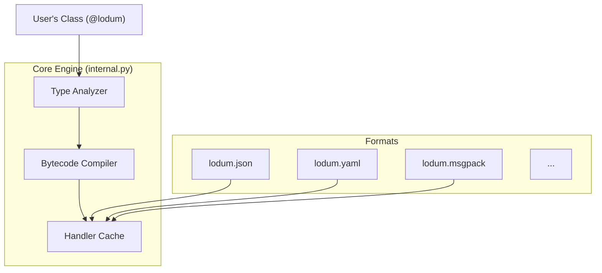

This document explains the internal design and performance strategies of Lodum. It is intended for contributors or power users who want to understand how the library works under the hood.

## Core Philosophy

Lodum is designed around three principles:

1. **Protocol-First**: Serialization logic is decoupled from the data format.
2. **Runtime Compilation**: We generate specialized bytecode for your classes to avoid overhead.
3. **Declarative Data**: The `@lodum` decorator captures the "shape" of data once, and it is reused everywhere.

## High-Level Architecture



## 1. The Dynamic Bytecode Engine

The heart of Lodum is in `src/lodum/internal.py`.

Unlike libraries that use generic introspection (looping over `__dict__` or using `getattr`) for every object, Lodum inspects your class **once**.

### Compilation Pipeline

1. **Analysis**: When you first call `dumps` or `loads`, the engine analyzes the type hints of your fields.
2. **AST Construction**: It constructs a Python Abstract Syntax Tree (AST) representing a highly optimized function specifically for that class.
   - *Example*: If your class has a `List[int]`, the generated AST will include nodes to check `isinstance(val, list)` directly and call the `int` loader for each item, typically unrolling standard overheads.
3. **Compilation**: The AST is compiled into a code object using Python's built-in `compile()`, which is then loaded via `exec()`. This avoids the security and fragility issues of string-based code generation.
4. **Binding**: This function is cached and reused for all future operations.

**Why?** This approach gives us performance close to hand-written code or compiled extensions, while staying 100% pure Python.

### Example: Compiled Handler

When you define a class like this:

```python
from lodum import lodum

@lodum
class User:
    def __init__(self, id: int, name: str, tags: list[str]):
        self.id = id
        self.name = name
        self.tags = tags
```

Lodum generates specialized functions similar to:

```python
def dump_User(obj, dumper, dump_fn, depth, seen):
    dumper.begin_struct(User)
    dumper.field("id", obj.id, int_handler, depth + 1, seen)
    dumper.field("name", obj.name, str_handler, depth + 1, seen)
    dumper.field("tags", obj.tags, list_str_handler, depth + 1, seen)
    return dumper.end_struct()
```

This eliminates the overhead of generic reflection on every serialization call.

## 2. The Abstract Protocols

Lodum uses two main protocols to bridge the gap between "Python Objects" and "Bytes/Strings".

### The `Dumper` Protocol

A `Dumper` knows how to take primitive types and write them to a specific format.

```python
class Dumper(Protocol):
    def dump_int(self, value: int, depth: int = 0, seen: Optional[set] = None) -> Any: ...
    def dump_str(self, value: str, depth: int = 0, seen: Optional[set] = None) -> Any: ...
    def dump_float(self, value: float, depth: int = 0, seen: Optional[set] = None) -> Any: ...
    def dump_bool(self, value: bool, depth: int = 0, seen: Optional[set] = None) -> Any: ...
    def dump_bytes(self, value: bytes, depth: int = 0, seen: Optional[set] = None) -> Any: ...
    def dump_none(self, depth: int = 0, seen: Optional[set] = None) -> Any: ...
    
    def begin_struct(self, cls: Type) -> Any: ...
    def end_struct(self) -> Any: ...
    def field(
        self,
        name: str,
        value: Any,
        handler: Callable[[Any, "Dumper", int, Optional[set]], Any],
        depth: int = 0,
        seen: Optional[set] = None,
    ) -> None: ...
    
    def begin_list(self) -> None: ...
    def end_list(self) -> Any: ...
    def list_item(
        self,
        value: Any,
        handler: Callable[[Any, "Dumper", int, Optional[set]], Any],
        depth: int = 0,
        seen: Optional[set] = None,
    ) -> None: ...
```

### The `Loader` Protocol

A `Loader` knows how to read primitive types from a specific format.

```python
class Loader(Protocol):
    def load_int(self) -> int: ...
    def load_str(self) -> str: ...
    def load_float(self) -> float: ...
    def load_bool(self) -> bool: ...
    def load_bytes(self) -> bytes: ...
    def load_list(self) -> Iterator['Loader']: ...
    def load_dict(self) -> Iterator[tuple[str, 'Loader']]: ...
    def load_any(self) -> Any: ...
    def mark(self) -> Any: ...
    def rewind(self, marker: Any) -> None: ...
    def get_dict(self) -> Optional[Union[Dict[str, Any], List[Any]]]: ...
    def load_bytes_value(self, value: Any) -> bytes: ...
```

### Extensibility

Because `internal.py` only talks to these protocols, **adding a new format** (like CBOR) is as simple as implementing these methods. The optimization engine automatically works for the new format without any changes.

### Base Classes

To reduce boilerplate when implementing new formats, `core.py` also provides `BaseDumper` and `BaseLoader`. These classes provide default implementations for many protocol methods (such as handling primitive types), allowing format authors to focus on the unique aspects of their format.

## 3. Validation & Schemas

### Validation Pipeline

Validation is injected directly into the generated `loads` handler.

1. **Decode**: The value is read from the wire (e.g., JSON string → Python `str`).
2. **Validate**: The value is passed to any validators defined in `field(validate=...)`.
3. **Instantiate**: Only if validation passes is the actual object created.

### Error Path Tracking

One of the key features of Lodum is precise error reporting. During deserialization, the generated loaders maintain a `path` string that tracks the current position in the data structure.

- When entering a dictionary/struct, the path is appended with `.field_name`.
- When entering a list, the path is appended with `[index]`.

This path is passed down through recursive calls to `load()`. If a `DeserializationError` occurs (e.g., a type mismatch or a validation failure), the error captures the current `path`. This allows Lodum to provide helpful error messages like:

```
Error at users[2].address.city: Expected str, got int
```

### Schema Generation

`json.schema()` uses a recursive visitor pattern to walk the type hints of a `@lodum` class and construct a standard JSON Schema dictionary. This is separate from the serialization engine but shares the same type analysis logic.

## 4. Thread Safety

Lodum uses a **Context** system for thread-safe operation:

```python
class Context:
    def __init__(self, registry: Optional["TypeRegistry"] = None) -> None:
        self.registry: "TypeRegistry" = registry.copy() if registry else global_registry.copy()
        self.dump_cache: Dict[Type[Any], "DumpHandler"] = {}
        self.load_cache: Dict[Type[Any], "LoadHandler"] = {}
        self.cache_lock = Lock()
        self.name_to_type_cache: Dict[str, Type[Any]] = {}
```

Key features:
- **Thread-local contexts**: Each thread can have its own context
- **Lock-free fast path**: Cache lookups don't require locks in the common case
- **Double-checked locking**: Only compilation requires lock acquisition

## Directory Structure

```
src/lodum/
├── core.py              # Abstract Base Classes / Protocols
├── internal.py          # The Compiler and Execution Engine
├── field.py             # The Field definition and configuration logic
├── validators.py        # Built-in validation classes
├── exception.py         # Custom exceptions
├── registry.py          # Type handler registry
├── schema.py            # JSON Schema generation
├── concurrency.py       # Thread-safe primitives
│
├── compiler/            # AST compilation subsystem
│   ├── analyzer.py      # Type analysis and field extraction
│   ├── dump_codegen.py  # AST generation for serialization
│   ├── load_codegen.py  # AST generation for deserialization
│   └── dsl.py           # AST builder DSL
│
├── handlers/            # Type-specific handlers
│   ├── base.py          # Primitive types
│   ├── collections.py   # Lists, dicts, sets, tuples
│   └── stdlib.py        # datetime, UUID, Decimal, etc.
│
├── json.py              # JSON format implementation
├── yaml.py              # YAML format implementation
├── msgpack.py           # MessagePack format implementation
├── cbor.py              # CBOR format implementation
├── pickle.py            # Pickle format implementation
└── toml.py              # TOML format implementation
```

## Key Implementation Details

### Handler Cache Lookup

From `internal.py:196-210`:

```python
def _get_dump_handler(t: Type[Any], excluding: Optional[Type[Any]] = None) -> DumpHandler:
    ctx = get_context()
    
    # Lock-free fast path for cache hits
    if t in ctx.dump_cache:
        return ctx.dump_cache[t]
    
    with ctx.cache_lock:
        # Double-check inside lock
        if t in ctx.dump_cache:
            return ctx.dump_cache[t]
        
        # ... compilation logic ...
```

This pattern ensures maximum performance for repeated serializations while maintaining thread safety.

### Circular Reference Detection

From `internal.py:137-163`:

```python
def dump(obj: Any, dumper: Dumper, depth: int = 0, seen: Optional[set] = None) -> Any:
    if depth > DEFAULT_MAX_DEPTH:
        raise SerializationError(f"Max recursion depth ({DEFAULT_MAX_DEPTH}) exceeded")
    
    if seen is None:
        seen = set()
    
    obj_id = id(obj)
    if obj_id in seen:
        raise SerializationError("Circular reference detected")
    
    # Only track containers to detect cycles
    is_container = isinstance(obj, (list, dict, set, tuple, ...))
    
    if is_container:
        seen.add(obj_id)
    
    try:
        handler = _get_dump_handler(type(obj))
        return handler(obj, dumper, depth, seen)
    finally:
        if is_container:
            seen.remove(obj_id)
```

## Performance Characteristics

- **First serialization/deserialization**: O(n) where n is the number of fields (due to compilation)
- **Subsequent operations**: O(m) where m is the size of the data (no reflection overhead)
- **Memory**: O(1) per class (one compiled handler)
- **Thread safety**: Lock-free reads, locked writes to cache